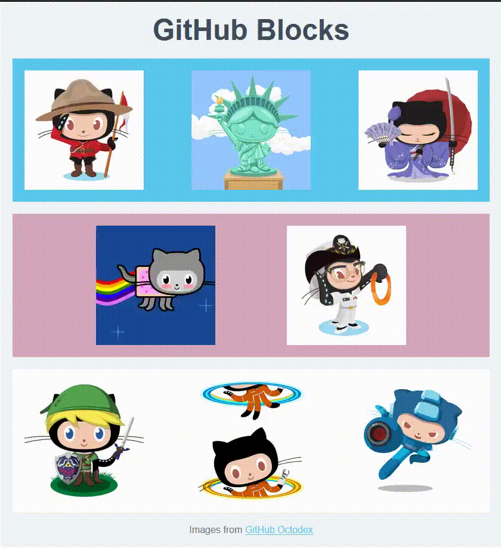

# wf_github_blocks

## Objectives
- Practice using the [Box Model](https://www.w3schools.com/css/css_boxmodel.asp) properties: padding, border, and margin.
- Practice what we've learned about Flexbox
- Practice using different values of justify-content.



Use margin and padding to adjust the spaces between the rows and use flexbox properties to be able to put each image in its proper place. Set the images to all have a uniform size.

```css
img.octocat {
    height: 200px;
}

```